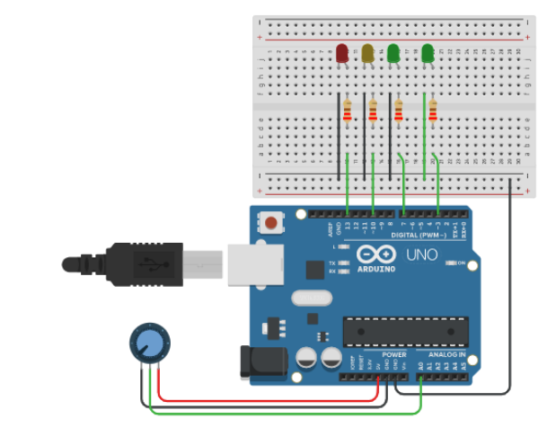

#Battery Charger

Este projeto tem como objetivo simular de forma simples o controle de carga de uma bateria comum.

## Lista de materiais:

 - 1 Arduino Uno Rev 3
 - 1 Cabo USB Tipo A-B
 - 2 Led Verde
 - 1 Led Amarelo
 - 1 Led Vermelho
 - 4 Resistor 220Ω

## Modelo esquemático em Protoboard



??? note "Código"
    ```c
    
    int pot = A0; 
    int valor; 

    int vermelho = 13;
    int amarelo = 10; 
    int verde2 = 7;
    int verde1 = 3;

    void setup() {

      Serial.begin(9600); 

    }

    void loop() {

        valor = analogRead(pot); 
        valor = map(valor, 0, 1023, 0, 255);
        Serial.print("Valor do Potenciometro = "); 
        Serial.println(valor); 

        //Led Vermelho

        if(incomingByte >= 0 && incomingByte < 60){

            digitalWrite(vermelho, HIGH);
            digitalWrite(amarelo, LOW);
            digitalWrite(verde2, LOW);
            digitalWrite(verde1, LOW);

            Serial.println("Liga Vermelho");
        }

        //Led Amarelo

        else if(incomingByte >= 60 && incomingByte < 120){

            digitalWrite(vermelho, LOW);
            digitalWrite(amarelo, HIGH);
            digitalWrite(verde2, LOW);
            digitalWrite(verde1, LOW);

            Serial.println("Liga Amarelo");
        }

        //Led Verde 2
        
        else if(incomingByte >= 120 && incomingByte < 180){
            
            digitalWrite(vermelho, LOW);
            digitalWrite(amarelo, LOW);
            digitalWrite(verde2, HIGH);
            digitalWrite(verde1, LOW);

            Serial.println("Liga Verde 2");
        }

        //Led Verde 1
        
        else if(incomingByte >= 180 && incomingByte < 255){

            digitalWrite(vermelho, LOW);
            digitalWrite(amarelo, LOW);
            digitalWrite(verde2, LOW);
            digitalWrite(verde1, HIGH);

            Serial.println("Liga Verde 1");
        }

        delay(250); 
    }
    ```

??? note "Código Comentado"
    ```c
    
    int pot = A0; 
    int valor; 

    int vermelho = 13;
    int amarelo = 10; 
    int verde2 = 7;
    int verde1 = 3;

    void setup() {

      Serial.begin(9600);
      pinMode(vermelho, OUTPUT);
      pinMode(amarelo, OUTPUT);
      pinMode(verde2, OUTPUT);
      pinMode(verde1, OUTPUT); 

    }

    void loop() {

        valor = analogRead(pot); 
        valor = map(valor, 0, 1023, 0, 255);
        Serial.print("Valor do Potenciometro = "); 
        Serial.println(valor); 

        //Led Vermelho

        if(incomingByte >= 0 && incomingByte < 60){

            digitalWrite(vermelho, HIGH);
            digitalWrite(amarelo, LOW);
            digitalWrite(verde2, LOW);
            digitalWrite(verde1, LOW);

            Serial.println("Liga Vermelho");
        }

        //Led Amarelo

        else if(incomingByte >= 60 && incomingByte < 120){

            digitalWrite(vermelho, LOW);
            digitalWrite(amarelo, HIGH);
            digitalWrite(verde2, LOW);
            digitalWrite(verde1, LOW);

            Serial.println("Liga Amarelo");
        }

        //Led Verde 2
        
        else if(incomingByte >= 120 && incomingByte < 180){
            
            digitalWrite(vermelho, LOW);
            digitalWrite(amarelo, LOW);
            digitalWrite(verde2, HIGH);
            digitalWrite(verde1, LOW);

            Serial.println("Liga Verde 2");
        }

        //Led Verde 1
        
        else if(incomingByte >= 180 && incomingByte < 255){

            digitalWrite(vermelho, LOW);
            digitalWrite(amarelo, LOW);
            digitalWrite(verde2, LOW);
            digitalWrite(verde1, HIGH);

            Serial.println("Liga Verde 1");
        }

        delay(250); 
    }
    ```

## Arquivos para Download

[](../arq/)          [](../arq/)