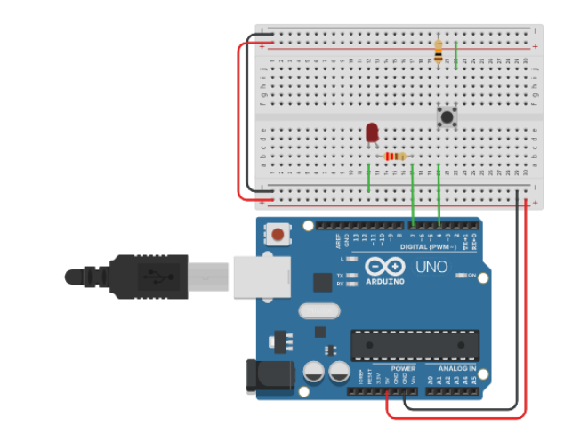

#Button

Este projeto tem como objetivo demonstrar como utilizar botões para leitura de sinais no Arduino.

## Lista de materiais:

 - 1 Arduino Uno Rev 3
 - 1 Cabo USB Tipo A-B
 - 1 Led
 - 1 Tactile Switch
 - 1 Resistor 220Ω
 - 1 Resistor 10KΩ

## Modelo esquemático em Protoboard



??? note "Código"
    ```c
    int botao = 4; 
    int led = 7; 

    int estado; 

    void setup() {
        pinMode(botao, INPUT); 
        pinMode(led, OUTPUT); 
    }
    void loop() {

        estado = digitalRead(botao); 
        if (estado == HIGH) { 
            digitalWrite(led, HIGH); 
        } else { 
            digitalWrite(led, LOW); 
      }
    }
    ```

??? note "Código Comentado"
    ```c
    int botao = 4; 
    int led = 7; 

    int estado; 

    void setup() {
        pinMode(botao, INPUT); 
        pinMode(led, OUTPUT); 
    }
    void loop() {

        estado = digitalRead(botao); 
        if (estado == HIGH) { 
            digitalWrite(led, HIGH); 
        } else { 
            digitalWrite(led, LOW); 
      }
    }
    ```

## Arquivos para Download

[](../arq/)          [](../arq/)