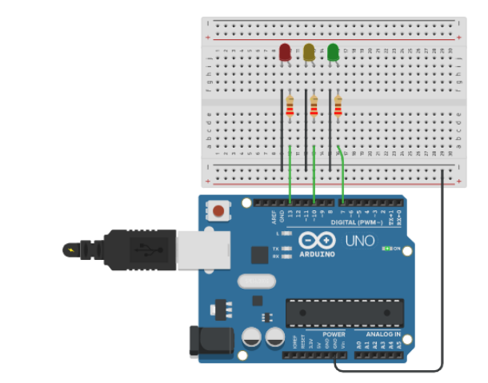

# Turn On/Off with If Else (Lock)

Este projeto tem como objetivo demonstrar o uso da estrutura de repetição [While](https://www.arduino.cc/reference/pt/language/structure/control-structure/while/) no bloqueio da função 'loop()' do Arduino.

## Lista de materiais

 - Arduino Uno Rev 3
 - Cabo USB Tipo A-B
 - 1 Led Verde
 - 1 Led Amarelo
 - 1 Led Vermelho
 - 3 Resistor 220Ω

## Modelo esquemático em Protoboard



??? note "Código"
    ```c
    int vermelho = 11;
    int amarelo = 10; 
    int verde = 9;     

    void setup() {
      
        pinMode(vermelho, OUTPUT);
        pinMode(amarelo, OUTPUT);
        pinMode(verde, OUTPUT);

        Serial.begin(9600);
    }

    void loop() {

      if (Serial.available() > 0) {
        int incomingByte = Serial.read();
        Serial.print("I received: ");
        Serial.println(incomingByte);

        //Led Vermelho

        if(incomingByte == 10){
            digitalWrite(vermelho, HIGH);
            Serial.println("Liga Vermelho");
        }
        else if(incomingByte == 11){
            digitalWrite(vermelho, HIGH);
            Serial.println("Desliga Vermelho");
        }

        //Led Amarelo

        else if(incomingByte == 20){
            digitalWrite(vermelho, HIGH);
            Serial.println("Liga Amarelo");
        }
        else if(incomingByte == 21){
            digitalWrite(vermelho, HIGH);
            Serial.println("Desliga Amarelo");
        }

        //Led Verde
        
        else if(incomingByte == 30){
            digitalWrite(vermelho, HIGH);
            Serial.println("Liga Verde");
        }
        else if(incomingByte == 31){
            digitalWrite(vermelho, HIGH);
            Serial.println("Desliga Verde");
        }

      }
      while(1);
    }
    ```

??? note "Código Comentado"
    ```c
    int vermelho = 11;
    int amarelo = 10; 
    int verde = 9;     

    void setup() {
      
        pinMode(vermelho, OUTPUT);
        pinMode(amarelo, OUTPUT);
        pinMode(verde, OUTPUT);

        Serial.begin(9600);
    }

    void loop() {

      if (Serial.available() > 0) {
        int incomingByte = Serial.read();
        Serial.print("I received: ");
        Serial.println(incomingByte);

        //Led Vermelho

        if(incomingByte == 10){
            digitalWrite(vermelho, HIGH);
            Serial.println("Liga Vermelho");
        }
        else if(incomingByte == 11){
            digitalWrite(vermelho, HIGH);
            Serial.println("Desliga Vermelho");
        }

        //Led Amarelo

        else if(incomingByte == 20){
            digitalWrite(vermelho, HIGH);
            Serial.println("Liga Amarelo");
        }
        else if(incomingByte == 21){
            digitalWrite(vermelho, HIGH);
            Serial.println("Desliga Amarelo");
        }

        //Led Verde
        
        else if(incomingByte == 30){
            digitalWrite(vermelho, HIGH);
            Serial.println("Liga Verde");
        }
        else if(incomingByte == 31){
            digitalWrite(vermelho, HIGH);
            Serial.println("Desliga Verde");
        }

      }
      while(1);
    }
    ```

## Arquivos para Download

[](../arq/)         [](../arq/)